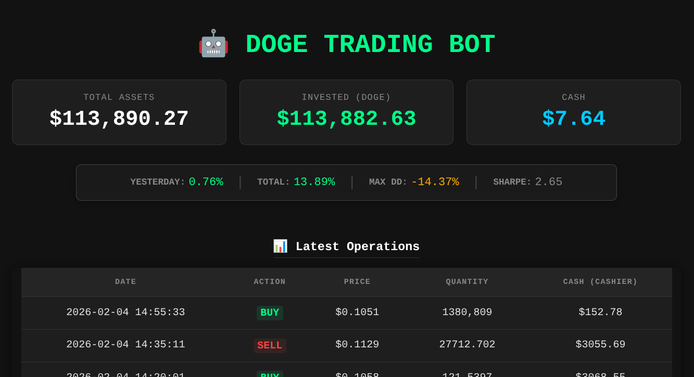
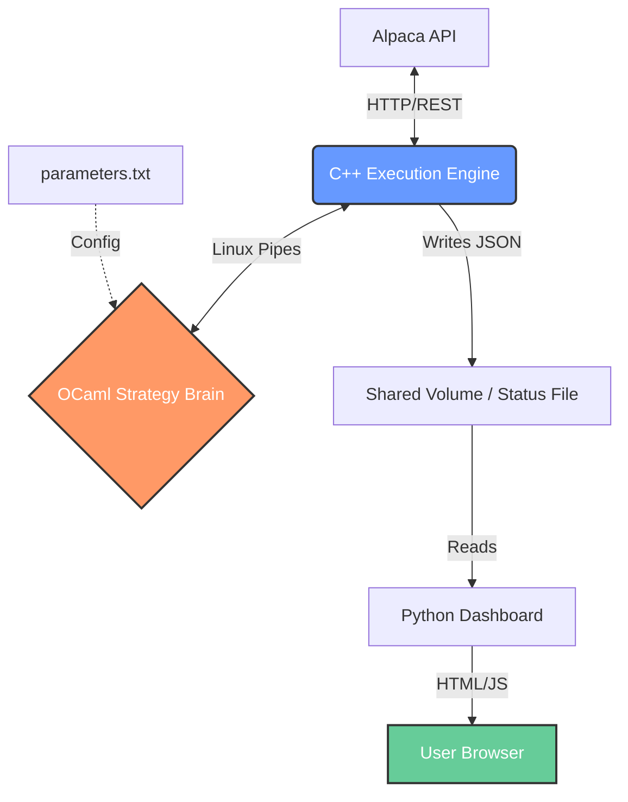

# HFT-Style Anomalies Trading Algorithm (C++ / OCaml / Python)

**A low-latency, microservices-based trading engine designed to automatically detect market price anomalies of a specific stock.**
This project implements a hybrid architecture where execution, strategy logic, and monitoring run as decoupled processes communicating via standard Linux IPC mechanisms.

[](http://adria-trading-bot.duckdns.org/live-quant-strategy-doge)
*(Fig 1: Real-time Dashboard showing automated performance analysis including Sharpe Ratio and Max Drawdown. Note: Data in this screenshot is simulated to demonstrate the statistical engine's capabilities over a longer timeframe.)*

## 🏗 System Architecture

The system follows a "Separation of Concerns" principle to maximize stability and minimize latency.



## 🔧 Core Components

* **Execution Engine (C++17):** Handles API connectivity (`libcurl`), order management, and safety checks. Optimized for speed and low overhead.
* **Strategy Core (OCaml):** Pure functional logic for market analysis. Isolated from the network layer to ensure deterministic behavior.
* **Inter-Process Communication:** Uses raw **Linux Pipes (`fork()` + `pipe()`)** to keep latency strictly minimal within the container.
* **Analytics Dashboard (Python/Flask/Waitress + NumPy):**
    * Connects to the live data stream.
    * **Automated Statistical Analysis:** Calculates **Sharpe Ratio**, **Max Drawdown**, and **Volatility** in real-time based on the trade history.
    * Provides a responsive UI for monitoring the bot from any device.

## 🧠 Decision Algorithm

The strategy logic operates on a discretized state space to identify mean-reversion opportunities.

1. **Prediction (Signal Processing):** The brain receives the latest market data and calculates the momentum ratio relative to the previous state. It maps this continuous ratio into a discretized **"Range Grid"**. Then compares the current range against an EMA-based prediction model to filter out noise and detect price anomalies.

2. **Decision (Thresholding):** A trade signal is generated if the divergence between the actual market range and the predicted range exceeds the `MinMargin` parameter. 
   * **Sell Signal:** Market reality is `MinMargin` or more above prediction.
   * **Buy Signal:** Market reality is `MinMargin` or more below prediction.

3. **Position Sizing (Asymptotic Allocation):** Instead of fixed lot sizes, the system dynamically calculates the optimal position size using a non-linear asymptotic formula. This allows the suer to define the strategy, manually depending on the stock, you can define an agressive entry strategy, that reacts strong at every minimum anomaly, a sniper-style strategy that waits for a big anomaly to take advantage of it with all the budget, or a linear buying one; it all depends on the $level$ value.
   
   The allocation formula is:

   $$SharesAmount(x) = Max \times \left(1 - (1 - x^{level})^{\frac{1}{level}}\right)$$

   *Where:*
   * $x$: The normalized deviation ratio ($CurrentRange / MaxRange$), with $0 \leq x \leq 1$.
   * $Max$: Maximum amount of shares allowed at the operation.
   * $level$: Convexity parameter (customizable in `parameters.txt`).

   **Interactive Visualization:**
   Understand how the `level` parameter affects the capital allocation curve by interacting with the graph below:

   [](https://www.desmos.com/calculator/lsct6txxp1)
   *(Click the image to test it yourself*

## 🚀 Key Engineering Features

1.  **Self-Correcting Order Management:** The C++ engine handles partial fills and network timeouts autonomously without crashing the strategy logic.
2.  **Containerized Security:** Runs in a hardened Docker container with a non-root user. API keys are injected via environment variables, never stored on disk.
3.  **Dynamic Performance Analysis:** Unlike static backtests, the system continuously evaluates its own performance metrics (P&L, Risk Ratios) using the `numpy` engine integrated into the web server.

## 📂 Project Structure

```bash
.
├── src/
│   ├── hands_api.cc      # C++ Execution Engine (Network & Order Management)
│   ├── brain7_2.ml       # OCaml Strategy Core (Math & Logic)
├── dashboard/            # Python Flask Analytics Engine
│   ├── app.py            # Analytics Backend
│   └── templates/        # Frontend UI
├── Dockerfile            # Multi-stage build definition (GCC + OCaml + Python)
├── Makefile              # Build automation
└── parameters.txt        # Runtime strategy configuration
```

## 🛠️ How to Run

Prerequisites: Docker & Docker Compose.

1.  **Clone the repository.**
2.  **Set up environment variables:**
    ```bash
    export APCA_API_KEY_ID="your_alpaca_key"
    export APCA_API_SECRET_KEY="your_alpaca_secret"
    ```
3.  **Build and Run:**
    ```bash
    docker build -t trading-bot .
    docker run -d --name bot \
      -e APCA_API_KEY_ID=$APCA_API_KEY_ID \
      -e APCA_API_SECRET_KEY=$APCA_API_SECRET_KEY \
      -p 80:5000 \
      trading-bot
    ```

---
*Note: This is a live project running on Oracle Cloud Infrastructure. You can monitor its performance live [here](http://adria-trading-bot.duckdns.org/live-quant-strategy-doge). 

**Why doge?** I wanted a volatile stock to generate more actions to see the bot working.*

*Disclaimer: This software is for educational purposes only. Do not risk capital you cannot afford to lose.*
