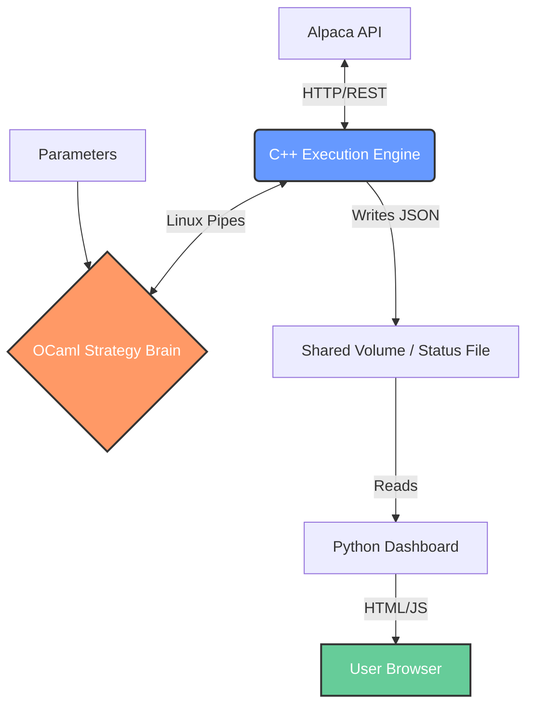

# HFT-Style Crypto Trading System (C++ / OCaml / Python)

**A low-latency, microservices-based trading engine designed for automated crypto strategies.**
This project implements a hybrid architecture where execution, strategy logic, and monitoring run as decoupled processes communicating via standard Linux IPC mechanisms.

*(Fig 1: Real-time Dashboard showing automated performance analysis including Sharpe Ratio and Max Drawdown, calculated dynamically from the execution history)*

## 🏗 System Architecture

The system follows a "Separation of Concerns" principle to maximize stability and minimize latency.

### 🔧 Core Components

* **Execution Engine (C++17):** Handles API connectivity (`libcurl`), order management, and safety checks. Optimized for speed and low overhead.
* **Strategy Core (OCaml):** Pure functional logic for market analysis. Isolated from the network layer to ensure deterministic behavior.
* **Inter-Process Communication:** Uses raw **Linux Pipes (`fork()` + `pipe()`)** instead of heavy message queues (like RabbitMQ) to keep latency strictly minimal within the container.
* **Analytics Dashboard (Python/Flask + NumPy):**
    * Connects to the live data stream.
    * **Automated Statistical Analysis:** Calculates **Sharpe Ratio**, **Max Drawdown**, and **Volatility** in real-time based on the trade history.
    * Provides a responsive UI for monitoring the bot from any device.

## 🚀 Key Engineering Features

1.  **Self-Correcting Order Management:** The C++ engine handles partial fills and network timeouts autonomously without crashing the strategy logic.
2.  **Containerized Security:** Runs in a hardened Docker container with a non-root user. API keys are injected via environment variables, never stored on disk.
3.  **Dynamic Performance Analysis:** Unlike static backtests, the system continuously evaluates its own performance metrics (P&L, Risk Ratios) using the `numpy` engine integrated into the web server.

---
*Note: This is a live project running on Oracle Cloud Infrastructure.*
