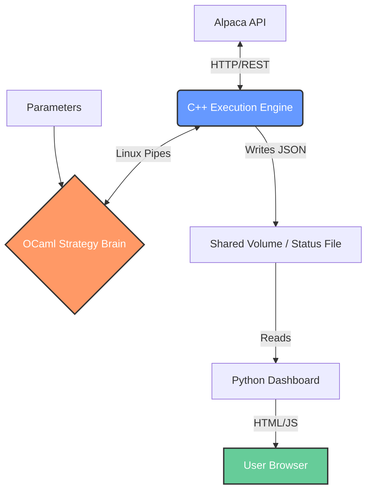

# HFT-Style Anomalies Trading Algorithm (C++ / OCaml / Python)

**A low-latency, microservices-based trading engine designed for automated crypto strategies.**
This project implements a hybrid architecture where execution, strategy logic, and monitoring run as decoupled processes communicating via standard Linux IPC mechanisms.


*(Fig 1: Real-time Dashboard showing automated performance analysis including Sharpe Ratio and Max Drawdown, calculated dynamically from the execution history)*

## 🏗 System Architecture

The system follows a "Separation of Concerns" principle to maximize stability and minimize latency.



### 🔧 Core Components

* **Execution Engine (C++17):** Handles API connectivity (`libcurl`), order management, and safety checks. Optimized for speed and low overhead.
* **Strategy Core (OCaml):** Pure functional logic for market analysis. Isolated from the network layer to ensure deterministic behavior.
* **Inter-Process Communication:** Uses raw **Linux Pipes (`fork()` + `pipe()`)** instead of heavy message queues (like RabbitMQ) to keep latency strictly minimal within the container.
* **Analytics Dashboard (Python/Flask + NumPy):**
    * Connects to the live data stream.
    * **Automated Statistical Analysis:** Calculates **Sharpe Ratio**, **Max Drawdown**, and **Volatility** in real-time based on the trade history.
    * Provides a responsive UI for monitoring the bot from any device.


### Decision algorithm

1. **Prediction** The brain recives the new market price, the mid point between open and close of the last candle, calculates the change ratio from last market price, and finds its range, it tries to predict this same range using the past ranges with an EMA predicting model. In this case a range is a grid, like a grid trading system, thats was implemented to secure benefits.

2. **Decision** If the actual value of the market is bigger anough than the prediction (```MinMargin``` bigger) it sells, if its ```MinMargin``` smaller it buys.

3. **Amount** To manipulate the amount of shares operating each moment it uses a formula that gives a proportion of the available shers to buy/sell each time. The formula is:
   $$SharesAmount(x) = (1 - (1 - x^{level})^{\frac{1}{level}}) * Max$$
where $$x$$ is the ratio $$x=CurrentRange/MaxRange$$ with
$$0 \leq x \leq 1$$
, $$Max$$ the maximum amount of shares beeing able to buy/sell, and $$level$$, $$MaxRange$$, and $$MinMargin$$ are custom values at ```parameters.txt```. 

Understand how the `level` parameter affects the shares distribution. Click the graph below to interact with the slider:

[](https://www.desmos.com/calculator/s4g8j9p6z2)

*Click on the image to open the interactive simulation where `a = level`.*

## 🚀 Key Engineering Features

1.  **Self-Correcting Order Management:** The C++ engine handles partial fills and network timeouts autonomously without crashing the strategy logic.
2.  **Containerized Security:** Runs in a hardened Docker container with a non-root user. API keys are injected via environment variables, never stored on disk.
3.  **Dynamic Performance Analysis:** Unlike static backtests, the system continuously evaluates its own performance metrics (P&L, Risk Ratios) using the `numpy` engine integrated into the web server.

---
*Note: This is a live project running on Oracle Cloud Infrastructure. You can see its peroformance live in [this link](http://adria-trading-bot.duckdns.org/live-quant-strategy-doge).*
