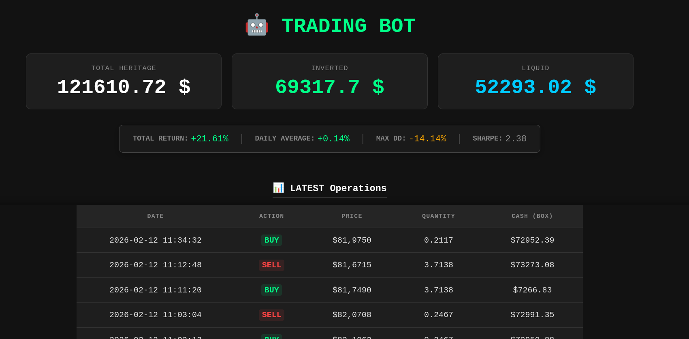
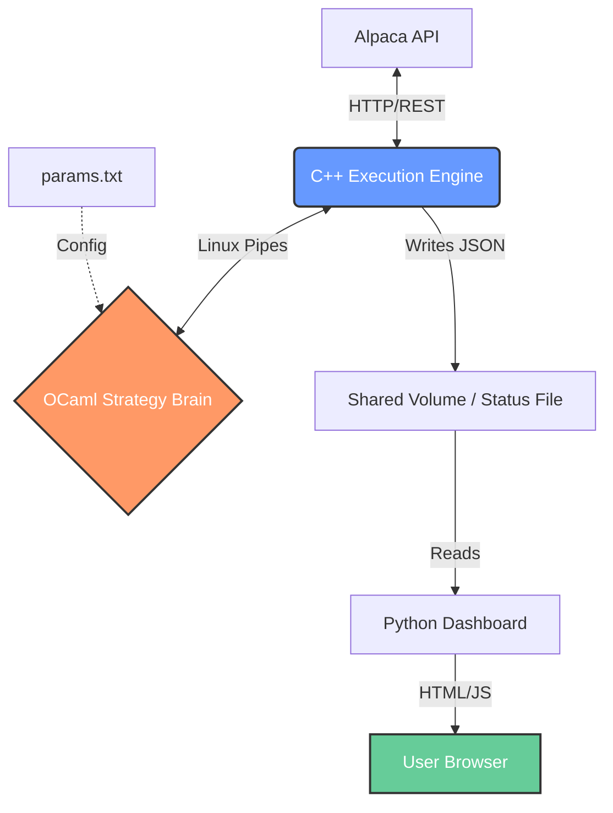
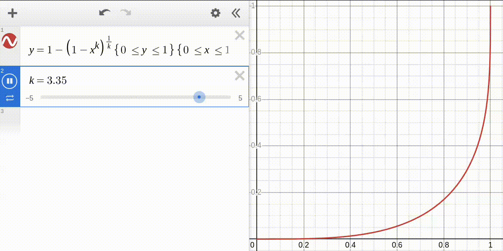
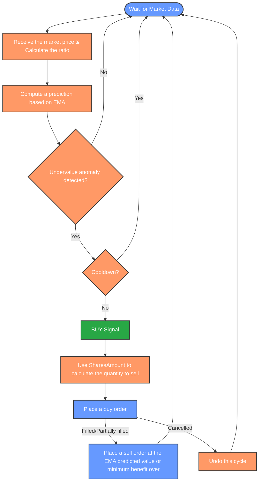
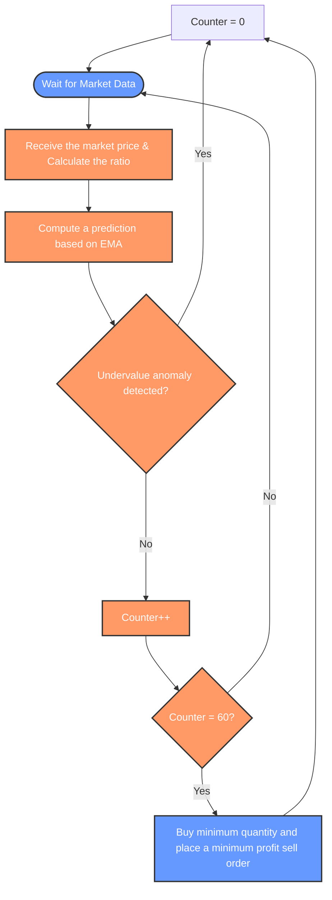

# Mean Reversion Grid Strategy with Hybrid Execution and Forced Capital Deployment (C++ / OCaml / Python)

**A low-latency, microservices-based trading engine designed to automatically detect market price anomalies of a specific stock.**
This project implements a hybrid architecture where execution, strategy logic, and monitoring run as decoupled processes communicating via standard Linux IPC mechanisms.

<div align="center">
  <a href="http://adria-trading-bot.duckdns.org/">
    
  </a>
  <br>
  <em>(Fig 1: Real-time Dashboard showing automated performance analysis including Sharpe Ratio and Max Drawdown. Note: Data in this screenshot is simulated. Click to see live dashboard with **real** data.)</em>
</div>

## 🏗 System Architecture

The system follows a "Separation of Concerns" principle to maximize stability and minimize latency.


```mermaid
graph TD
    A[Alpaca API] <-->|HTTP/REST| B(C++ Execution Engine);
    B <-->|Linux Pipes| C{OCaml Strategy Brain};
    B -->|Writes JSON| D[Shared Volume / Status File];
    D -->|Reads| E[Python Dashboard];
    E -->|HTML/JS| F[User Browser];
    G[params.txt] -.->|Config| C    
    style B fill:#69f,stroke:#333,stroke-width:2px,color:white
    style C fill:#f96,stroke:#333,stroke-width:2px,color:white
    style F fill:#6c9,stroke:#333,stroke-width:2px,color:white
```

## 🔧 Core Components

* **Execution Engine (C++17):** Handles API connectivity (`libcurl`), order management, and safety checks. Optimized for speed and low overhead.
* **Strategy Core (OCaml):** Pure functional logic for market analysis. Isolated from the network layer to ensure deterministic behavior.
* **Inter-Process Communication:** Uses raw **Linux Pipes (`fork()` + `pipe()`)** to keep latency strictly minimal within the container.
* **Analytics Dashboard (Python/Flask/Waitress + NumPy):**
    * Connects to the live data stream.
    * **Automated Statistical Analysis:** Calculates **Sharpe Ratio**, **Max Drawdown**, and **Volatility** in real-time based on the trade history.
    * Provides a responsive UI for monitoring the bot from any device.

## 🧠 Decision Algorithm

### The main logic (The Mean Reversion Grid Strategy with Hybrid Execution)

The strategy logic operates on a discretized state space to identify mean-reversion buy opportunities.

1. **Prediction (Signal Processing):** The brain receives the latest market data and calculates the momentum ratio relative to the previous state. Then compares the current ratio against an EMA-based prediction model to filter out noise and detect price anomalies.

2. **Decision (Thresholding):** A trade signal is generated if the divergence between the actual market range and the predicted range exceeds the `MinMargin` parameter. And its only used when it is an undervalue anomaly:
   * **Buy Signal:** Market reality is `MinMargin` or less below prediction. That's a perfect moment to buy (Taker). In case of successfull buy (filled/partially filled) the bot places a selling order at the EMA predicted value (Maker).

3. **Position Sizing (Asymptotic Allocation):** Instead of fixed lot sizes, the system dynamically calculates the optimal position size using a non-linear asymptotic formula. This allows the user to define the strategy, manually depending on the stock, you can define an aggressive entry strategy, that reacts strong at every minimum anomaly, a sniper-style strategy that waits for a big anomaly to take advantage of it with all the budget, or a linear buying one; it all depends on the $level$ value.
   
   The allocation formula is:

   $$SharesAmount(x) = Max \times \left(1 - (1 - x^{level})^{\frac{1}{level}}\right)$$

   *Where:*
   * $x$: The normalized deviation ratio ($CurrentRange / MaxRange$), with $0 \leq x \leq 1$.
   * $Max$: Maximum amount of shares allowed at the operation.
   * $level$: Convexity parameter (customizable in `parameters.txt`).

   **Interactive Visualization:**
   Understand how the `level` parameter affects the capital allocation curve by interacting with the graph below:

   <div align="center" style="margin-left: 15px;">
      <a href="https://www.desmos.com/calculator/lsct6txxp1">
        
      </a>
      <br>
      <em>(Click to open interactive graphic)</em>
   </div>

#### Algorithm Diagram


```mermaid
graph TD
    A([Wait for Market Data]) --> B[Receive the market price & Calculate the ratio];
    B --> C[Compute a prediction based on EMA];
    C --> D{Undervalue anomaly detected?};
    
    D -- No ----> A
    D -- Yes --> N{Cooldown?}
    N -- Yes --> A
    N -- No --> G[BUY Signal];

    G --> I[Use SharesAmount to calculate the quantity to sell];

    I --> J[Place a buy order];
    J -- Filled/Partially filled --> K[Place a sell order at the EMA predicted value or minimum benefit over];
    K --> A
    J -- Cancelled --> M[Undo this cycle]
    M --> A

    style A fill:#69f,stroke:#333,stroke-width:2px,color:white
    style K fill:#69f,stroke:#333,stroke-width:2px,color:white
    style J fill:#69f,stroke:#333,stroke-width:2px,color:white
    style G fill:#28a745,stroke:#333,stroke-width:2px,color:white
    style B fill:#f96,stroke:#333,stroke-width:2px,color:white
    style C fill:#f96,stroke:#333,stroke-width:2px,color:white
    style D fill:#f96,stroke:#333,stroke-width:2px,color:white
    style M fill:#f96,stroke:#333,stroke-width:2px,color:white
    style I fill:#f96,stroke:#333,stroke-width:2px,color:white
    style N fill:#f96,stroke:#333,stroke-width:2px,color:white
```
### Side logic (The Forced Capital Deployment)

When it has been 22.5 minutes without any buy the bot buys without an anomaly and places a sell order at a price of a minimum benefit just enough to cover the exchange fees, the estimated slippage and get a net target profit of 0.15%. This way the bot is never stopped and if the market overvalues the asset or becomes bull market the bot will take advantage of it.

#### Algorithm Logic


```mermaid
graph TD
    E[Counter = 0] --> A([Wait for Market Data])
    A --> B[Receive the market price & Calculate the ratio];
    B --> C[Compute a prediction based on EMA];
    C --> D{Undervalue anomaly detected?};
    
    D -- No ----> F[Counter++]
    D -- Yes --> E;

    F --> G{Counter = 60?}
    G -- Yes --> H[Buy minimum quantity and place a minimum profit sell order]
    G -- No --> A
    H --> E

    style A fill:#69f,stroke:#333,stroke-width:2px,color:white
    style H fill:#69f,stroke:#333,stroke-width:2px,color:white
    style B fill:#f96,stroke:#333,stroke-width:2px,color:white
    style C fill:#f96,stroke:#333,stroke-width:2px,color:white
    style D fill:#f96,stroke:#333,stroke-width:2px,color:white
    style F fill:#f96,stroke:#333,stroke-width:2px,color:white
    style G fill:#f96,stroke:#333,stroke-width:2px,color:white
```

## Why an EMA?

To accurately detect market anomalies, the system utilizes a prediction model based on Exponential Smoothing. This approach aligns with the industry standard set by [RiskMetrics (J.P. Morgan)](https://www.msci.com/documents/10199/5915b101-4206-4ba0-aee2-3449d5c7e95a), which validates the use of exponential weighting to address the heteroscedastic nature of financial markets.

Furthermore, the [NIST e-Handbook of Statistical Methods](https://www.itl.nist.gov/div898/handbook/pmc/section4/pmc431.htm) classifies this method as a "short-term memory" model. By mathematically prioritizing new data over older observations, the algorithm effectively reduces the "lag" inherent in trend-following indicators, enabling the precise detection of trend reversals and rapid price shifts.

## 🚀 Key Engineering Features

1.  **Self-Correcting Order Management:** The C++ engine handles partial fills and network timeouts autonomously without crashing the strategy logic.
2.  **Containerized Security:** Runs in a hardened Docker container with a non-root user. API keys are injected via environment variables, never stored on disk.
3.  **Dynamic Performance Analysis:** Unlike static backtests, the system continuously evaluates its own performance metrics (P&L, Risk Ratios) using the `numpy` engine integrated into the web server.

## 🏗️ Project Architecture

The system follows a secure **microservices architecture** managed by Docker Compose:

1.  **Bot Core (C++ / OCaml):** * Executes trades via Alpaca API.
    * Writes real-time status to `status.json`.
    * *Privileges:* Read/Write on data.
2.  **The Accountant (Python Watcher):** * Background process that calculates High Water Mark and Max Drawdown.
    * Updates `metrics.json` only when status changes.
    * *Privileges:* Write access to metrics.
3.  **The Dashboard (Python Flask):** * Visualizes performance and trades.
    * **Security:** Runs in a **Read-Only** container with a restricted user (UID 1001). It cannot modify code or data even if compromised.

## 📂 Project Structure

```text
|-- MDmedia
  |  |-- grafic.gif
  |  |-- image.png
  |-- readme.md
  |-- trading_bot
  |  |-- Dockerfile
  |  |-- Makefile
  |  |-- brain
  |  |  |-- brain8.ml
  |  |  |-- brain_refactored
  |  |  |  |-- Comm.ml
  |  |  |  |-- Config.ml
  |  |  |  |-- Engine.ml
  |  |  |  |-- Main.ml
  |  |  |  |-- Makefile
  |  |  |  |-- Strategy.ml
  |  |  |  |-- Types.ml
  |  |-- dashboard
  |  |  |-- metrics.json
  |  |-- data.csv
  |  |-- docker-compose.yml
  |  |-- get-docker.sh
  |  |-- hands
  |  |  |-- alpaca_bot_refactored
  |  |  |  |-- CMakeLists.txt
  |  |  |  |-- include
  |  |  |  |  |-- AlpacaAPI.hpp
  |  |  |  |  |-- BrainCommunicator.hpp
  |  |  |  |  |-- OrderManager.hpp
  |  |  |  |  |-- Types.hpp
  |  |  |  |  |-- Utils.hpp
  |  |  |  |-- src
  |  |  |  |  |-- AlpacaAPI.cpp
  |  |  |  |  |-- BrainCommunicator.cpp
  |  |  |  |  |-- OrderManager.cpp
  |  |  |  |  |-- Utils.cpp
  |  |  |  |  |-- main.cpp
  |  |  |-- hands_api.cc
  |  |-- kk.txt
  |  |-- logs.txt
  |  |-- metrics
  |  |  |-- equity_history.json
  |  |  |-- ini_w.txt
  |  |  |-- last_100.csv
  |  |  |-- metrics_watcher.py
  |  |-- params.json
  |  |-- params.txt
  |  |-- refactored_lab.tar.gz
  |  |-- status.json
  |  |-- v
  |-- trading_bot_laboratory
  |  |-- Dockerfile
  |  |-- Makefile
  |  |-- brain
  |  |  |-- brain9.ml
  |  |  |-- brain_refactored
  |  |  |  |-- Comm.ml
  |  |  |  |-- Config.ml
  |  |  |  |-- Engine.ml
  |  |  |  |-- Main.ml
  |  |  |  |-- Makefile
  |  |  |  |-- Strategy.ml
  |  |  |  |-- Types.ml
  |  |-- dashboard
  |  |  |-- metrics.json
  |  |-- data.csv
  |  |-- docker-compose.yml
  |  |-- hands
  |  |  |-- alpaca_bot_refactored
  |  |  |  |-- CMakeLists.txt
  |  |  |  |-- include
  |  |  |  |  |-- AlpacaAPI.hpp
  |  |  |  |  |-- BrainCommunicator.hpp
  |  |  |  |  |-- OrderManager.hpp
  |  |  |  |  |-- Types.hpp
  |  |  |  |  |-- Utils.hpp
  |  |  |  |-- src
  |  |  |  |  |-- AlpacaAPI.cpp
  |  |  |  |  |-- BrainCommunicator.cpp
  |  |  |  |  |-- OrderManager.cpp
  |  |  |  |  |-- Utils.cpp
  |  |  |  |  |-- main.cpp
  |  |  |-- hands_api9.cc
  |  |-- kk.txt
  |  |-- logs.txt
  |  |-- metrics
  |  |  |-- equity_history.json
  |  |  |-- ini_w.txt
  |  |  |-- last_100.csv
  |  |  |-- metrics_watcher.py
  |  |-- params.json
  |  |-- params.txt
  |  |-- refactored_lab.tar.gz
  |  |-- status.json
  |  |-- v
  |-- web
  |  |-- Dockerfile
  |  |-- app.py
  |  |-- data_curr
  |  |  |-- data.csv
  |  |  |-- metrics.json
  |  |  |-- status.json
  |  |-- data_exp
  |  |  |-- data.csv
  |  |  |-- metrics.json
  |  |  |-- status.json
  |  |-- docker-compose.yml
  |  |-- templates
  |  |  |-- index.html
```

## 🛠️ How to Run

### Prerequisites
* **Docker & Docker Compose** (Plugin v2 recommended).
* **Alpaca Markets API Key** (Paper or Live).

### 1. Setup Environment
Clone the repository and export your API keys in your terminal:

1. Create a file names `.env`

2. Write the following text in it:

```bash
export APCA_API_KEY_ID="your_alpaca_key"
export APCA_API_SECRET_KEY="your_alpaca_secret"
```

### 2. Initialize Data Files Permissions
Create the necessary JSON files and set permissions. This step is **critical** for the secure microservices architecture (ensuring the Watcher can write while the Web can only read).

```bash
# 1. Create necessary files if they don't exist
touch data.csv status.json
touch dashboard/metrics.json
touch metrics/last_100.csv metrics/equity_history.json

# 2. Set Write Permissions
# Allow the non-root Docker users (UID 1000 & 1001) to write to these files.
# '666' allows read/write for everyone, ensuring smooth IPC between containers.
chmod 666 data.csv status.json dashboard/metrics.json metrics/last_100.csv metrics/equity_history.json
```

### 3. Build & Run
Deploy the entire stack (Core, Web, and Watcher) with a single command. Docker Compose will handle the build and network creation automatically.

```bash
cd /Project_home/trading_bot/
docker compose up -d --build
cd ../web/
docker compose up -d --build
```
---
*Note: This is a live project running on Google Cloud Infrastructure. You can monitor its performance live [here](http://adria-trading-bot.duckdns.org/). 

*Disclaimer: This software is for educational purposes only. Do not risk capital you cannot afford to lose.*
